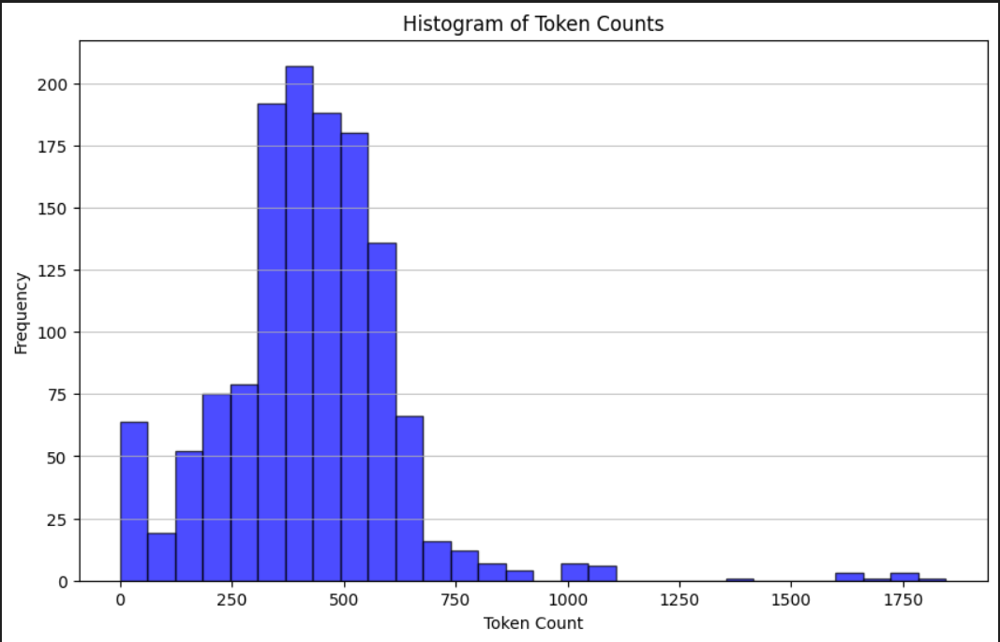
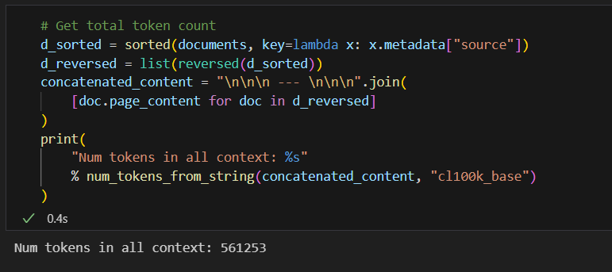
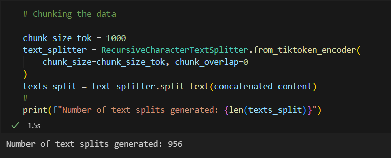
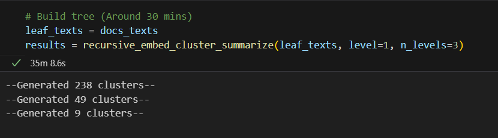

# AI Question-Answering System using Recursive Abstractive Processing for Tree-Organized Retrieval (RAPTOR) and LangChain

## Table of Contents
1. [Overview of RAPTOR](#overview-of-raptor)
2. [Tools and Technologies](#tools-and-technologies)
    - [Installing Milvus on Windows with WSL 2 enabled](#installing-milvus-on-windows-with-wsl-2-enabled-link-for-reference)
3. [Running the Code](#running-the-code)
    
4. [Project Demonstration and Output](#project-demonstration-and-output)
5. [Link to PDFs used](#link-to-pdfs-used)
6. [Reference](#reference)

### Overview of RAPTOR
Source: [RAPTOR paper](https://arxiv.org/html/2401.18059v1#bib.bib26)

RAPTOR is designed to tackle the challenge of semantic depth and connection in reading long texts, which often have subtopics and hierarchical structures (Cao & Wang, 2022; Dong et al., 2023b). It builds a recursive tree structure that balances broader thematic understanding with detailed information, grouping nodes based on semantic similarity rather than just their order in the text.

#### Tree Construction
1. Segmenting Texts:
    * We start by dividing the retrieval corpus into short, contiguous texts of 100 tokens each.
    * If a sentence exceeds the 100-token limit, we move the entire sentence to the next chunk to maintain contextual and semantic coherence.

2. Embedding:
    * Text chunks are embedded using SBERT, a BERT-based encoder.
    * These chunks and their embeddings form the leaf nodes of the tree structure.

3. Clustering and Summarization:
    * A clustering algorithm groups similar text chunks.
    * A Language Model summarizes the grouped texts.
    * Summarized texts are re-embedded, and the cycle of embedding, clustering, and summarization continues until further clustering becomes infeasible.

#### Querying Strategies
1. Tree Traversal: Traverses the tree layer-by-layer, pruning and selecting the most relevant nodes at each leve

2. Collapsed Tree: Evaluates nodes collectively across all layers to find the most relevant ones.


### Tools and Technologies
>
>* Python 3.11.9
>
>* Langchain
>
>* Models:
>    1. LLM: gemini-flash-1.5-latest
>    2. Embedding model: sentence-transformers/all-MiniLM-L6-v2
>
>* Windows with WSL 2 enabled [(Install WSL 2)](https://learn.microsoft.com/en-us/windows/wsl/install)
>
>* Docker Desktop [(Install Docker)](https://docs.docker.com/desktop/install/windows-install/#wsl-2-backend)
>
>* Milvus vector database [Starting a Milvus container in Docker Desktop]()
>

#### Installing Milvus on Windows with WSL 2 enabled [(Link for reference)](https://milvus.io/docs/install_standalone-docker.md)
* Install your preferred distribution of Linux. Here I have used Ubuntu which is the default distribution.
* Open Linux command line and create a directory where you will install the Milvus files
* Use a cURL command to download the installation script
* Start Docker Container

```bash
$ mkdir <directory-name>

$ cd <directory-name>

$ curl -sfL https://raw.githubusercontent.com/milvus-io/milvus/master/scripts/standalone_embed.sh -o standalone_embed.sh

$ bash standalone_embed.sh start
```

>A docker container named milvus will start at port 19530

Note: If you see the error **docker: command not found** when you try to run **bash standalone_embed.sh start**
1. Open **Docker Destop**
2. Navigate to **Settings**
3. From the side menu, navigate to **Resources** and then **WSL Integration**
4. Select the **Enable integration with my default WSL distro** option or select your distribution
5. Run **bash standalone_embed.sh start**

### Running the Code

1. Clone the repository
```bash
git clone https://github.com/HumdaanSyed/AI-QA-System-with-RAPTOR.git
```
2. Create a Virtual/Conda Environment in your Project Folder

    * Download and install Python 3.11.9 from the official Python website if you are creating a virtual environment (venv)
    * Open your Project folder in VS Code
    * Open the Command Palette (Ctrl+Shift+P on Windows/Linux)
    * Select 'Python: Create Environment' and then 'Venv' or 'Conda'
    * If you are creating a virtual environment you must select the Python 3.11.9 interpreter from the drop-down
    * In the case of a conda environment you can just choose the python version you want.

3. You must put your preference of PDF documents into the data folder of the project.

4. Install required libraries:

    * Open terminal in your Project Folder and install requirements.txt

    ```
        pip install -r requirements.txt
    ```

5. In Cell 12, change the query variable with your desired query

    ```python
    query = "your query here"
    response = rag_chain.invoke(query)

    # Print Response
    print(str(response))

    # Print source
    get_metadata(query)
    ```

6. Run the notebook to get the answer to your query along with possible sources for reference (PDF title and page numbers)


### Project Demonstration and Output

### Link to PDFs used

>**The PDFs I have used for my implementation are linked [here](https://drive.google.com/drive/folders/1K3cBSbokoZeViHaf4DT-TiJP7-P4uaiO?usp=drive_link)**  
>**Each PDF has >300 pages**

#### 1. Histogram of token counts
```python
# Function that returns token count
def num_tokens_from_string(string: str, encoding_name: str) -> int:
    """Returns the number of tokens in a text string."""
    encoding = tiktoken.get_encoding(encoding_name)
    num_tokens = len(encoding.encode(string))
    return num_tokens


docs_texts = [d.page_content for d in documents] # Store content of each page in list

# Visualize token count in docs_texts
counts = [num_tokens_from_string(d, "cl100k_base") for d in docs_texts]

plt.figure(figsize=(10, 6))
plt.hist(counts, bins=30, color="blue", edgecolor="black", alpha=0.7)
plt.title("Histogram of Token Counts")
plt.xlabel("Token Count")
plt.ylabel("Frequency")
plt.grid(axis="y", alpha=0.75)

plt.show()
```



#### 2. Total token count




#### 3. Chunking the data




#### 4. Clustering and Summarisation with RAPTOR




#### 5. Build Vector stores and instantiate retrievers

```python
# Initialize all_texts with leaf_texts
all_texts = leaf_texts.copy()

# Iterate through the results to extract summaries from each level and add them to all_texts
for level in sorted(results.keys()):
    
    summaries = results[level][1]["summaries"].tolist()
    all_texts.extend(summaries)

# Use all_texts to build vector store using MILVUS
vectorstore_raptor = Milvus.from_texts(
    texts=all_texts,
    embedding=embd,
    collection_name="RaptorCollection",
    connection_args={
        "uri": "http://localhost:19530",
    },
    drop_old=True,
)

#Use documents and build vector store for retrieving metadata (Page and Source)
vectorstore_metad = Milvus.from_documents(
    documents=documents,
    embedding=embd,
    collection_name="MetaData",
    connection_args={
        "uri": "http://localhost:19530",
    },
    drop_old=True,
    )

# Instantiate response retriever
answer_retriever = vectorstore_raptor.as_retriever(search_kwargs={"k": 5})

#Instatiate metadata retriever
metadata_retriever = vectorstore_metad.as_retriever()
```

#### 6. Building RAG chain and getting metadata

```python
# Chain
rag_chain = (
    {"context": answer_retriever | format_docs, "question": RunnablePassthrough()}
    | prompt
    | model
    | StrOutputParser()
)

def get_metadata(query):

    # Retrieve 4 documents that match the query and get their metadata
    metadata_docs = metadata_retriever.invoke(query) 
    metadata_list = [doc.metadata for doc in metadata_docs]

    final_metadata = defaultdict(list)

    for d in metadata_list:
        final_metadata[d['source']].append(d['page'])

    print("Source for reference:" )
    for source, pages in final_metadata.items():
        print(f"Book: {source} => Page numbers: {sorted(pages)}")
```


#### 7. Response to Query 1

```python
query = "Can you explain the importance of handling missing data in a dataset, and describe the different methods available in Python for managing missing values? Additionally, how do techniques like imputation and interpolation differ, and in what scenarios would you prefer one over the other?"
response = rag_chain.invoke(query)

# Print Response
print(str(response))

# Print source
get_metadata(query)
```

```
# Response

Handling missing data is crucial because it can significantly impact the accuracy and reliability of data analysis and machine learning models. If left unaddressed, missing data can lead to biased results, inaccurate predictions, and flawed conclusions.

Here are the common methods for managing missing values in Python:

**1. Deletion:**

* **Listwise Deletion:**  Removes entire rows containing missing values. This is simple but can lead to significant data loss, especially if missing values are frequent.
* **Pairwise Deletion:**  Excludes cases with missing values only for specific calculations, but this can introduce bias if missingness is not random.

**2. Imputation:**

* **Mean/Median/Mode Imputation:** Replaces missing values with the mean, median, or mode of the respective column. This is simple but can distort the distribution of the data.
* **K-Nearest Neighbors (KNN) Imputation:**  Uses the values of nearest neighbors to predict missing values. This can be more accurate than simple mean/median imputation but can be computationally expensive.
* **Regression Imputation:**  Uses a regression model to predict missing values based on other variables. This can be effective if there is a strong relationship between the missing variable and other variables.

**3. Interpolation:**

* **Linear Interpolation:**  Estimates missing values based on a linear relationship between neighboring values. This is suitable for data with a clear linear trend.
* **Spline Interpolation:**  Uses a smooth curve to estimate missing values, which can be more accurate than linear interpolation for data with non-linear trends.

**Difference between Imputation and Interpolation:**

* **Imputation:** Replaces missing values with estimated values based on the existing data. It's suitable for situations where the missing values are scattered randomly.
* **Interpolation:**  Estimates missing values based on the relationship between neighboring values. It's suitable for data with a clear trend or pattern.

**When to prefer one over the other:**

* **Imputation:**  Preferable when missing values are scattered randomly and there's no clear trend in the data.
* **Interpolation:**  Preferable when there's a clear trend or pattern in the data and missing values are sequential.

The choice of method depends on the nature of the data, the extent of missing values, and the specific analysis goals. It's important to carefully consider the potential biases and limitations of each method before applying it. 

Source for reference:
Book: data\Python_for_Data_Science_For_Dummies.pdf => Page numbers: [132, 133, 134]
Book: data\Artificial_Intelligence_For_Dummies.pdf => Page numbers: [53]
```


#### 8. Response to Query 2

```python
query = "Give a detailed explanation of neural networks. Give examples when possible."
```

```
#Response

Neural networks are a type of machine learning model inspired by the structure and function of the human brain. They consist of interconnected nodes, called neurons, organized in layers. Each neuron receives input from other neurons, performs a simple calculation, and then outputs a value to other neurons.

Here's a breakdown of key components:

* **Neurons:** The basic building blocks of a neural network. They receive input signals, perform a weighted sum of those inputs, apply an activation function, and output a value.
* **Activation Functions:** These functions introduce non-linearity into the network, allowing it to learn complex patterns. Common activation functions include sigmoid, ReLU, and tanh.
* **Layers:** Neurons are organized into layers. The first layer is the input layer, which receives data. The last layer is the output layer, which produces the network's predictions. Hidden layers lie between the input and output layers and perform intermediate computations.
* **Weights:** Each connection between neurons has a weight associated with it. These weights represent the strength of the connection and are adjusted during training to improve the network's performance.
* **Backpropagation:** This algorithm is used to train neural networks. It calculates the error between the network's predictions and the actual values and uses this error to adjust the weights.

**Example: The Perceptron**

The perceptron is a simple neural network that can be used to implement simple logic gates. It consists of a single neuron with multiple inputs and a single output. The neuron calculates a weighted sum of its inputs and applies a step function to determine its output.

For example, consider a perceptron with two inputs, x1 and x2, and a single output, y. The neuron's output is calculated as follows:

    
    y = step_function(w1 * x1 + w2 * x2 + b)
    

where w1 and w2 are the weights, b is the bias, and step_function is a function that outputs 1 if its input is greater than or equal to 0, and 0 otherwise.

By adjusting the weights and bias, the perceptron can be trained to implement different logic gates, such as AND, OR, and XOR.

**Example: Deep Learning**

Deep learning is a type of machine learning that uses deep neural networks with multiple hidden layers to learn complex patterns from data. These networks can be used for a wide range of tasks, including image recognition, natural language processing, and machine translation.

For example, a deep neural network can be trained to recognize handwritten digits from images. The network would have an input layer that receives the image data, multiple hidden layers that perform intermediate computations, and an output layer that predicts the digit.

**Key Advantages of Neural Networks:**

* **Non-linearity:** They can learn complex patterns that are not linearly separable.
* **Feature Learning:** They can automatically learn features from data, reducing the need for manual feature engineering.
* **Generalization:** They can generalize well to new data, even if it is different from the data they were trained on.

**Limitations of Neural Networks:**

* **Black Box:** It can be difficult to understand how they make predictions.
* **Data Requirements:** They require large amounts of data to train effectively.
* **Computational Cost:** Training and running large neural networks can be computationally expensive.

Overall, neural networks are a powerful tool for machine learning, but they have limitations that need to be considered. 

Source for reference:
Book: data\Artificial_Intelligence_For_Dummies.pdf => Page numbers: [191, 195, 197]
Book: data\Data_Science_from_Scratch.pdf => Page numbers: [291]
```

### Reference

1. [RAPTOR Paper (Sarthi et al)](https://arxiv.org/html/2401.18059v1#bib.bib26)
2. [RAPTOR Github](https://github.com/parthsarthi03/raptor/blob/master/raptor/cluster_tree_builder.py)
3. [Tweaks to RAPTOR by LlamaIndex](https://github.com/run-llama/llama_index/blob/main/llama-index-packs/llama-index-packs-raptor/llama_index/packs/raptor/clustering.py)
4. [Milvus Documentation](https://milvus.io/)
5. [Building RAG chain using LCEL](https://towardsdatascience.com/building-a-rag-chain-using-langchain-expression-language-lcel-3688260cad05)
6. [Langchain Documentation](https://python.langchain.com/v0.2/docs/integrations/platforms/)
